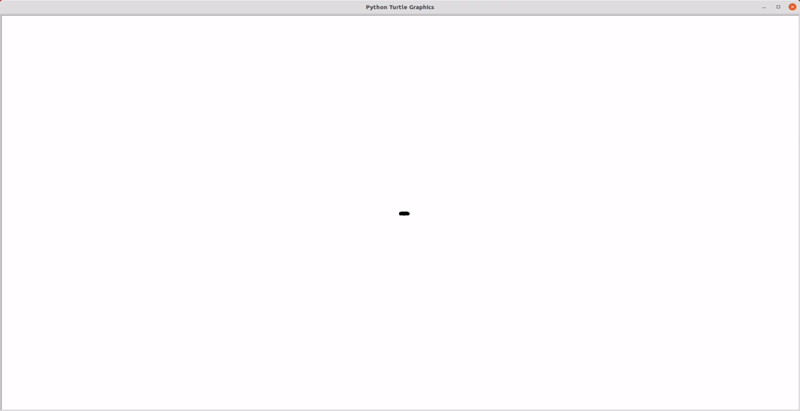
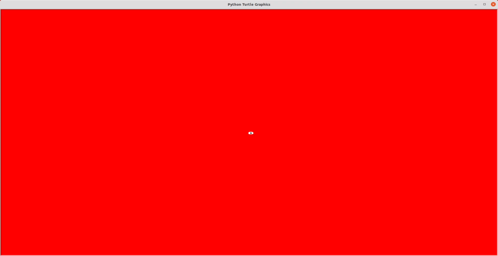
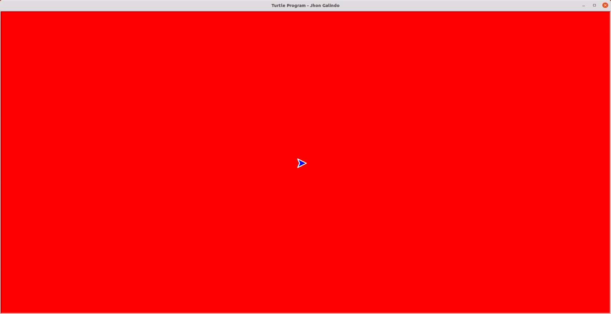
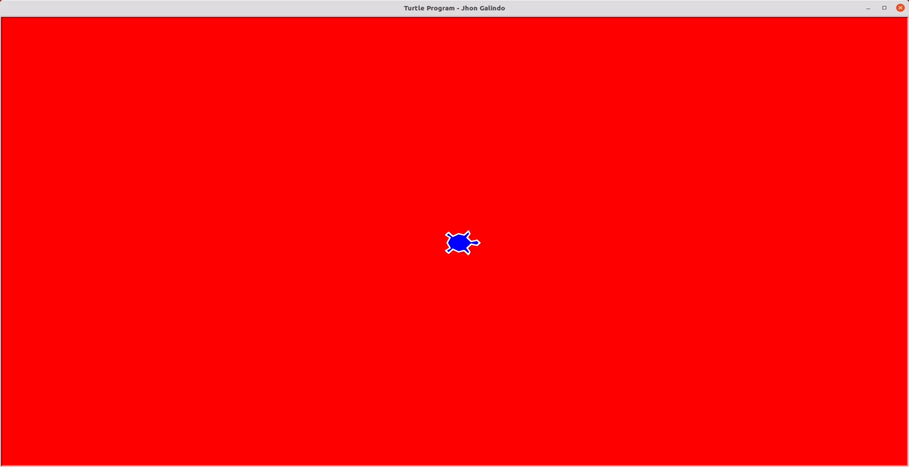
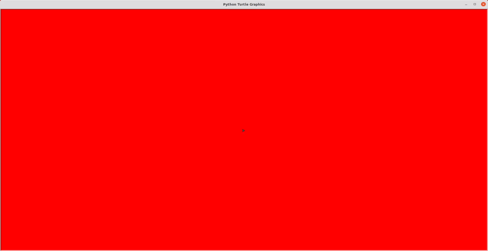
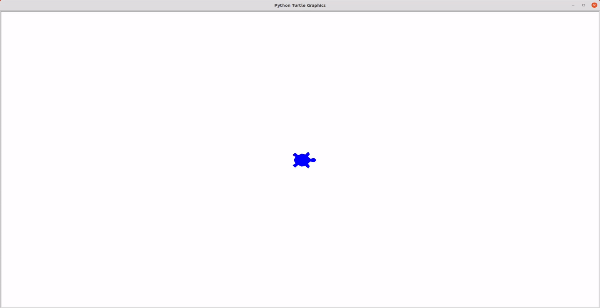
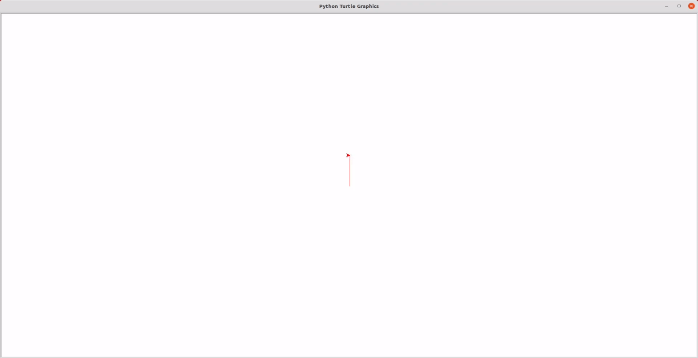

# Lesson 0: Algorithms with Turtle 

*Python* is an excellent language to start programming, especially for kids. 

Usually, a *Python* course starts with algorithms definition, so I will use the library *Turtle* to show the meaning and implementation of an algorithm in *Python*.

**Definition:** An algorithm is a finite sequence of steps to generate a result.

## Work session

1. Initially, we will discuss the algorithm's concept and how a sequence of steps allows the creation of different kinds of tools.

2. Secondly, we will have the opportunity to develop ten exercises, each one with a different level of difficulty.

3. Finally, with the team, we will analyze the results of the exercises and choose the most interesting of them.

## Exercise 1: Draw a line 

```{code-block} python
import turtle

#Screen configutarion
screen = turtle.Screen()
screen.setup(width = 1.0, height = 1.0)

#Create a turtle
t = turtle.Turtle()

#Move turtle
t.speed(1)
t.forward(400)

turtle.done()
```

<a class="" data-lightbox="Cargar proyecto" href="_static/lesson1/example1.gif" title="Cargar proyecto" data-title="Cargar proyecto">
</a>

## Exercise 2: Change line's size

```{code-block} python
import turtle

#Screen configutarion
screen = turtle.Screen()
screen.setup(width = 1.0, height = 1.0)

#Create a turtle
t = turtle.Turtle()

#Turtle configuration
t.pensize(10)

#Move turtle
t.speed(1)
t.forward(400)

turtle.done()
```

<a class="" data-lightbox="Cargar proyecto" href="_static/lesson1/example2.gif" title="Cargar proyecto" data-title="Cargar proyecto">
</a>

## Exercise 3: Change background and line colour 

```{code-block} python
import turtle

#Screen configutarion
screen = turtle.Screen()
screen.setup(width = 1.0, height = 1.0)
screen.bgcolor("red")

#Create a turtle
t = turtle.Turtle()

#Turtle configuration
t.pensize(10)
t.pencolor("white")

#Move turtle
t.speed(1)
t.forward(400)

turtle.done()
```

<a class="" data-lightbox="Cargar proyecto" href="_static/lesson1/example3.gif" title="Cargar proyecto" data-title="Cargar proyecto">
</a>

## Exercise 4: Modify Turtle's colour and shape

```{code-block} python
import turtle

#Screen configutarion
screen = turtle.Screen()
screen.setup(width = 1.0, height = 1.0)
screen.bgcolor("red")
screen.title("Turtle Program - Jhon Galindo")

#Create a turtle
t = turtle.Turtle()

#Turtle configuration
t.pensize(10)
t.pencolor("white")
t.shapesize(3,3,3)
t.fillcolor("blue")

#Move turtle
t.speed(1)
t.forward(400)

turtle.done()
```

<a class="" data-lightbox="Cargar proyecto" href="_static/lesson1/example4.gif" title="Cargar proyecto" data-title="Cargar proyecto">
</a>

## Exercise 5: Draw two lines  

```{code-block} python
import turtle

#Screen configutarion
screen = turtle.Screen()
screen.setup(width = 1.0, height = 1.0)
screen.bgcolor("red")
screen.title("Turtle Program - Jhon Galindo")

#Create a turtle
t = turtle.Turtle()

#Turtle configuration
t.pensize(10)
t.pencolor("white")
t.shapesize(3,3,3)
t.fillcolor("blue")
t.shape("turtle")

#Move turtle
t.speed(1)
t.forward(400)
t.left(90)
t.forward(400)

turtle.done()
```

<a class="" data-lightbox="Cargar proyecto" href="_static/lesson1/example5.gif" title="Cargar proyecto" data-title="Cargar proyecto">
</a>

## Exercise 6: Draw a square

```{code-block} python
import turtle

#Screen configutarion
screen = turtle.Screen()
screen.setup(width = 1.0, height = 1.0)
screen.bgcolor("red")
screen.title("Turtle Program - Jhon Galindo")

#Create a turtle
t = turtle.Turtle()

#Turtle configuration
t.pensize(10)
t.pencolor("white")
t.shapesize(3,3,3)
t.fillcolor("blue")
t.shape("turtle")

#Move turtle
t.speed(1)
t.forward(400)
t.left(90)
t.forward(400)
t.left(90)
t.forward(400)
t.left(90)
t.forward(400)

turtle.done()
```

<a class="" data-lightbox="Cargar proyecto" href="_static/lesson1/example6.gif" title="Cargar proyecto" data-title="Cargar proyecto">
</a>

## Exercise 7: Drawing of square, dot and circle

```{code-block} python
import turtle

#Screen configutarion
screen = turtle.Screen()
screen.setup(width = 1.0, height = 1.0)
screen.bgcolor("red")
screen.title("Turtle Program - Jhon Galindo")

#Create a turtle
t = turtle.Turtle()

#Turtle configuration
t.pensize(10)
t.pencolor("white")
t.shapesize(3,3,3)
t.fillcolor("blue")
t.shape("turtle")

#Move turtle
t.speed(1)
t.forward(400)
t.left(90)
t.forward(400)
t.left(90)
t.forward(400)
t.left(90)
t.forward(400)
t.dot(80)
t.circle(200)

turtle.done()
```

<a class="" data-lightbox="Cargar proyecto" href="_static/lesson1/example7.gif" title="Cargar proyecto" data-title="Cargar proyecto">
</a>

## Exercise 8: Fill the circle

```{code-block} python
import turtle

#Screen configutarion
screen = turtle.Screen()
screen.setup(width = 1.0, height = 1.0)
screen.bgcolor("red")
screen.title("Turtle Program - Jhon Galindo")

#Create a turtle
t = turtle.Turtle()

#Turtle configuration
t.pensize(10)
t.pencolor("white")
t.shapesize(3,3,3)
t.fillcolor("blue")
t.shape("turtle")

#Move turtle
t.speed(1)
t.forward(400)
t.left(90)
t.forward(400)
t.left(90)
t.forward(400)
t.left(90)
t.forward(400)
t.dot(80)

#fill circle
t.begin_fill()
t.circle(200)
t.end_fill()

turtle.done()
```

<a class="" data-lightbox="Cargar proyecto" href="_static/lesson1/example8.gif" title="Cargar proyecto" data-title="Cargar proyecto">
</a>

## Exercise 9: Create Olympic Games logo

```{code-block} python
import turtle
 
t = turtle.Turtle()

#Screen Configuration
screen = turtle.Screen()
screen.setup(width = 1.0, height = 1.0)

#Turtle configuration
t.pensize(10)
t.pencolor("white")
t.shapesize(3,3,3)
t.fillcolor("blue")
t.shape("turtle")

#blue circle
t.penup()
t.pencolor("blue")
t.goto(0, 0)
t.pendown()
t.circle(100)

#black circle
t.penup()
t.pencolor("black")
t.goto(220, 0)
t.pendown()
t.circle(100)

#red circle
t.penup()
t.pencolor("red")
t.goto(440, 0)
t.pendown()
t.circle(100)

#yellow circle
t.penup()
t.pencolor("yellow")
t.goto(110, -100)
t.pendown()
t.circle(100)

#green circle
t.penup()
t.pencolor("green")
t.goto(330, -100)
t.pendown()
t.circle(100)
 
turtle.done()
```

<a class="" data-lightbox="Cargar proyecto" href="_static/lesson1/example9.gif" title="Cargar proyecto" data-title="Cargar proyecto">
</a>

## Exercise 10: Drawing a Maple Leaf

```{code-block} python
import turtle
t = turtle.Turtle()

#Screen Configuration
screen = turtle.Screen()
screen.setup(width = 1.0, height = 1.0)

def draw_leaf(size):
    leaf_points = [[0, 7], [-1.2, 4.4], [-3, 5], [-2, 1],
                   [-4, 3], [-4.3, 1.5], [-7, 2.5], [-5.5, 0],
                   [-7, -1], [-3.3, -3.4], [-4, -5], [-0.2, -4.2],
                   [-0.2, -8], [0.2, -8], [0.2, -4.2], [4, -5],
                   [3.3, -3.4], [7, -1], [5.5, 0], [7, 2.5],
                   [4.3, 1.5], [4, 3], [2, 1], [3, 5],
                   [1.2, 4.4], [0, 7]]
    t.color('red')
    t.begin_fill()
    for (x, y) in leaf_points:
        t.goto(x * size, y * size)
    t.end_fill()


draw_leaf(size=40)
turtle.done() 
```

<a class="" data-lightbox="Cargar proyecto" href="_static/lesson1/example10.gif" title="Cargar proyecto" data-title="Cargar proyecto">
</a>